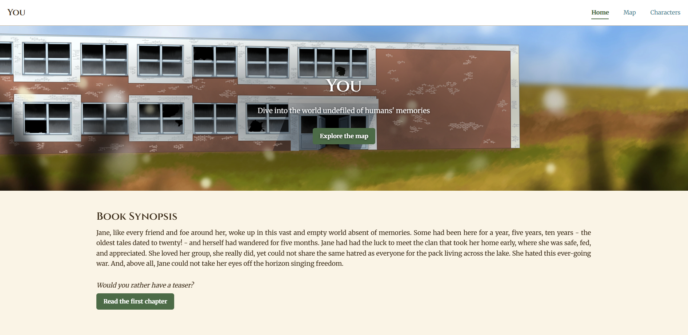
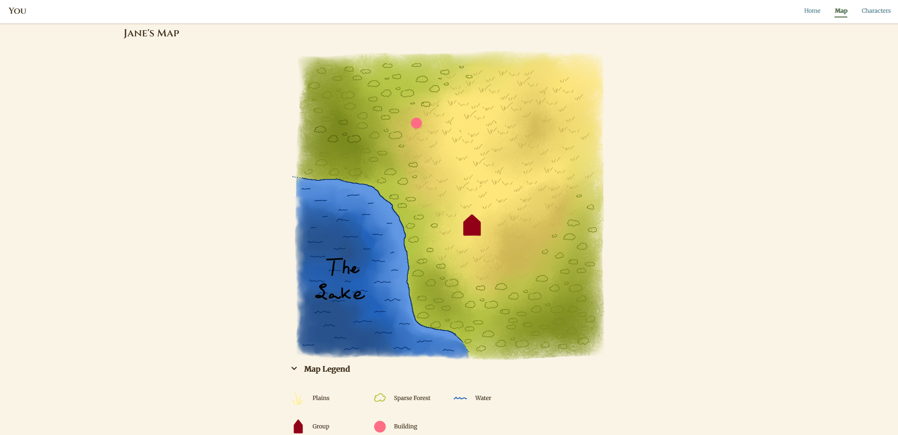
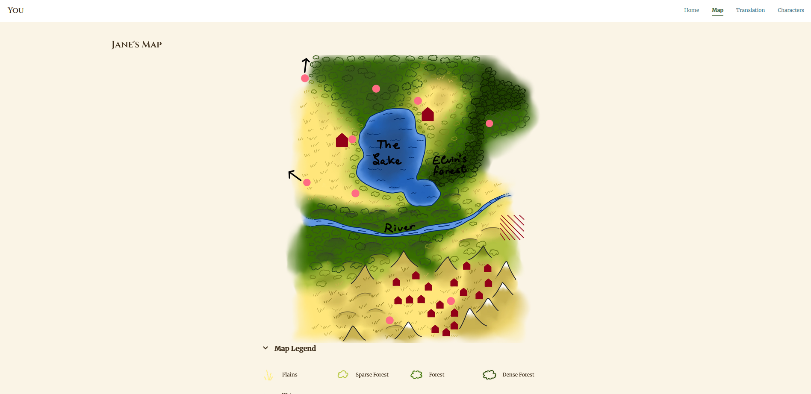

# You — A Spoiler-Aware Companion Website

A companion website for the original novel **_You_** that adapts to each reader's
progress, revealing lore, maps, and characters **only up to the chapter they've
reached** — so no one is ever spoiled by content ahead of where they are.

[](https://github.com/amelie-lemay/you-website/actions/workflows/azure-static-web-apps-kind-water-069991910.yml)


**Live site:** [you-novel.com](https://you-novel.com)



---

## Table of Contents

- [Overview](#overview)
- [Key Features](#key-features)
- [Tech Stack](#tech-stack)
- [Architecture & How It Works](#architecture--how-it-works)
- [Project Structure](#project-structure)
- [Running Locally](#running-locally)
- [Deployment](#deployment)
- [Make It Your Own](#make-it-your-own)
- [License & Content Notice](#license--content-notice)

---

## Overview

_You_ is a fiction novel in which every character wakes up in a strange world with no
memories. This website is its companion piece: an in-universe guide to the maps,
characters, and places the protagonist discovers along the way.

Unlike most companion sites that assume a reader has finished the book, this site's defining
feature is that it is **spoiler-aware**. Readers tell the site which chapter they've reached,
and every page reshapes itself to that point in the story — a character's age, allegiance,
and even the map itself. Read further, update your chapter, and the site quietly reveals
what you've now earned the right to see.

It's built as a fully static website with **no framework and no build step** —
just hand-written HTML, CSS, and modern JavaScript modules.

|                                                  Chapter 1                                                   |                                              Chapter 18                                               |
| :----------------------------------------------------------------------------------------------------------: | :---------------------------------------------------------------------------------------------------: |
|  |  |

---

## Key Features

- **Spoiler-aware content** — every page reveals only what the reader has reached.
- **Chapter-versioned data** — content values change per chapter, resolved at render time.
- **Cross-tab sync** — updating the chapter in one tab updates all open tabs instantly.
- **JSON-driven** — all story content lives in editable JSON, separate from the code.
- **Reusable HTML partials** — shared UI injected at runtime with graceful fallbacks.
- **Interactive map** — per-chapter map with clickable regions and a collapsible legend.
- **Accessible by design** — ARIA, keyboard support, and touch/mouse detection.
- **Resilient storage** — falls back to in-memory storage when browser storage is blocked.
- **Validated contact form** — inline validation, submitted via [Web3Forms](https://web3forms.com).

---

## Tech Stack

| Layer         | Technology                                    |
| ------------- | --------------------------------------------- |
| Markup        | HTML5                                         |
| Styling       | CSS3 (one shared stylesheet + one per page)   |
| Behaviour     | Vanilla JavaScript (ES modules), no framework |
| Content       | JSON files under `/content`                   |
| Forms         | [Web3Forms](https://web3forms.com)            |
| Accessibility | ARIA attributes + semantic HTML               |
| Hosting       | Azure Static Web Apps                         |
| CI/CD         | GitHub Actions                                |
| Fonts         | Google Fonts (Cinzel, Merriweather)           |

---

## Architecture & How It Works

The heart of the project is the **chapter-progress engine** in
[`js/shared.js`](js/shared.js), which every page depends on.

**1. The reader picks a chapter.**
On first visit, a progress popup asks the reader where they are in the book. The
choice is saved to `localStorage` so it persists across visits.

**2. Content is stored per chapter.**
Content files describe how a value changes over the course of the story. For
example, Jane's data lists a different age and allegiance for different chapters:

```json
{
  "name": { "ch-1": "Jane" },
  "age": { "ch-1": "4 months", "ch-12": "5 months", "ch-32": "1 year" },
  "allegiance": { "ch-1": "Blue clan", "ch-18": "None", "ch-21": "The pack" }
}
```

**3. The correct value is resolved at render time.**
A helper (`getClosestChapterValue`) finds the most recent value at or before the
reader's current chapter, so a reader on chapter 20 sees Jane's allegiance as
`"None"` (set at chapter 18), never the later `"The pack"` reveal. The same idea
drives the map image, regions, groups, and buildings.

**4. Pages stay in sync.**
When the reader updates their chapter, a `chapterChange` event fires and each
page re-injects its content. A storage listener propagates the change to other
open tabs.

**5. Shared UI is composed at runtime.**
Common fragments (`includes/*.html`) are fetched and injected into each page, so
the header, footer, and other shared elements are defined once and reused
everywhere.

---

## Project Structure

```
you-website/
├── index.html              # Home
├── map.html                # Interactive map
├── characters.html         # Character profiles
├── translation.html        # In-book French → English dialogue
├── contact.html            # Contact form
├── css/                    # shared.css + one stylesheet per page
├── js/
│   ├── shared.js           # Progress engine, content resolution, shared UI
│   ├── home.js
│   ├── map.js
│   ├── characters.js
│   ├── translation.js
│   └── contact.js
├── includes/               # Reusable HTML partials (header, footer, banner, …)
├── content/                # Story content as JSON (+ chapter 1 PDF teaser)
│   ├── characters/
│   ├── map/
│   ├── home/
│   └── translations/
├── img/                    # Artwork, maps, and legend icons
├── .github/workflows/      # Azure Static Web Apps CI/CD
├── LICENSE                 # MIT (source code)
└── NOTICE                  # Content copyright terms
```

---

## Running Locally

The site must be served over HTTP. Use any static file server from the project root. For example:

```bash
# Using Node
npx serve .

# Using Python
python -m http.server 8000
```

---

## Deployment

This site is deployed to **Azure Static Web Apps**, with continuous deployment
handled by the GitHub Actions workflow in
[`.github/workflows`](.github/workflows).

Since this is a fully static site with no build step, it isn't tied to Azure —
it can be hosted just as easily on any static host such as Netlify, Vercel,
etc.

---

## Make It Your Own

The engine is deliberately decoupled from the story, so it can power a companion
site for a completely different book with **no changes to the JavaScript logic**.
At a high level:

1. Replace the JSON files in [`content/`](content) with your own characters,
   maps, groups, and translations (or remove pages that don't belong to your book) while
   keeping the `ch-<number>` structure.
2. Swap the artwork and maps in [`img/`](img).
3. Update a few constants in [`js/shared.js`](js/shared.js) — for example
   `LAST_CHAPTER` (the total number of chapters) and `TEXT_VERSION` (bump it to
   invalidate cached content after an update).
4. Edit the static copy in the HTML pages (synopsis, page text, links) and the color palette in the CSS sheets.

---

## License & Content Notice

This repository contains **both source code and creative content**, which are
licensed differently:

- **Source code** (HTML / CSS / JS) is licensed under the [MIT License](LICENSE).
  You are welcome to fork the repository and adapt the code for your own
  projects.
- **Creative content** (everything in [`content/`](content) and [`img/`](img) —
  narrative text, lore, and original artwork) is **© 2026 Amélie Lemay** and is
  **not** covered by the MIT License. See [`NOTICE`](NOTICE) for details.
